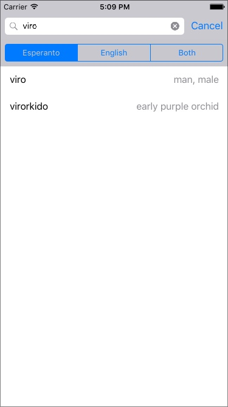
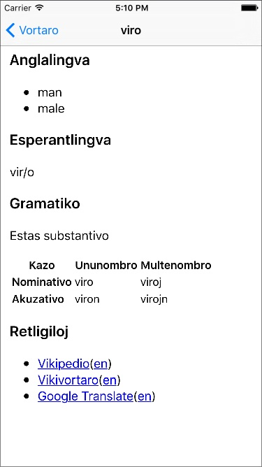

Vortaro
=======

A simple, yet powerful, Esperanto-English dictionary iPhone app.

Usage
-----
Write the first letters in the word you're looking for in the search box. By default it searches in Esperanto, change to English or Both as preferred. In any case the sorting is done by Esperanto.

Diacritic marks are automatically added, so if you search or "si" you will find both "si" and "ŝi".

The result will be presented with the Esperanto word/phrase on the left and english translations on the right, separated by commas.

Click on a word to get some more information about it, including the english translations, the word in esperanto with suffixes separated with a slash, a grammar section including case and verb tables and links to further research the word on Wikipedia, Wiktionary and Google Translate.

Power usage
-----------
The search is backed by [regular expressions](https://en.wikipedia.org/wiki/Regular_expression). All search patterns are automatically prefixed with $, to search in the beginning of the word.

Some example patterns:

| Pattern        | Result                                          |
| -------------- | ----------------------------------------------- |
| `viro`         | "viro" as prefix                                |
| `viro$`        | "viro" as full word, only one hit               |
| `.*viro`       | "viro" anywhere in the word                     |
| `.*viro$`      | "viro" as suffix                                |
| `vi.*ro$`      | "vi" as prefix and "ro" as suffix               |
| `vi..ro$`      | "vi" as prefix and "ro" as suffix, six letters  |
| `vi.{5}ro$`    | "vi" as prefix and "ro" as suffix, nine letters |
| `(viro|hundo)` | "viro" or "hundo" as prefix                     |
| `.*oj?n?$`     | all nouns                                       |

The regular expressions are powered by [ICU's Regular Expressions package](http://userguide.icu-project.org/strings/regexp).

Credits
-------
* Developed by [Jan Andersson](https://github.com/janne).
* Dictionary is the great [ESPDIC by Paul Denisowski](http://www.denisowski.org/Esperanto/espdic_readme.htm) under [Creative Commons 3.0 Unported License](http://creativecommons.org/licenses/by/3.0/).

License
-------
Licensed under [MIT license](https://github.com/janne/vortaro/blob/master/LICENSE).
